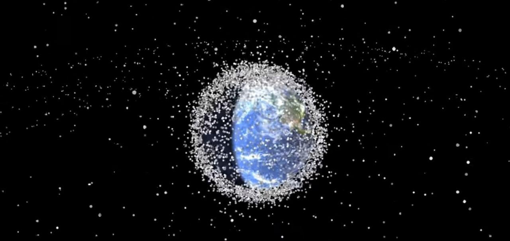

# Reporte Proyecto Integrador (Inteligencia Artificial, Compilación y Simulación)

# El peligro en la órbita

## Integrantes

- Javier E. Domínguez Hernández C-312 (@dmguezjaviersnet)
- David Orlando De Quesada Oliva C-311 (@dav1ddq0)
- Daniel De La Cruz C-311 (@dcruzp)

Desde que comenzó la era espacial, se han lanzado al espacio satélites, se han llevado a cabo
expediciones a la Luna, se han lanzado misiones a varios planetas, incluso a los lugares mas
lejanos del cosmos. Como resultado de esto en la órbita terrestre se ha creado una especie de
''basurero espacial'', satélites y estaciones espaciales han sido dejados a su suerte y han quedado
varados simplemente orbitando nuestro planeta, muchos de estos fragmentándose y creando
basura espacial, más pequeña pero peligrosa aun así. Como resultado de esto ya se han
producido varios accidentes en el espacio, fragmentos de esta basura, que han impactado
satélites, estaciones espaciales funcionales y han ocasionado daños preocupantes, incluso
destrozando algún que otro objeto, generando aún más basura, de diferentes tamaños y que se
nos plantea como un problema de cara al futuro, pues los próximos lanzamientos que tengan
que cruzar esta zona donde hay basura espacial, con cada colisión, corren más peligro de ser
impactados por estos fragmentos.

Por estas razones pensamos que desarrollar un sistema que usando datos reales de la cantidad y
ubicación de la basura en la órbita terrestre, sea capaz de facilitar información relevante a los
responsables de las futuras misiones al espacio, incluso correr simulaciones antes de llevar a
cabo la misión, puede resultar muy útil.

Consideramos que así no solo se podría disminuir la probabilidad de una colisión, sino incluso
podría ser usado para si en un futuro es posible recolectar dicha basura, facilitar dicho proceso.

## En concreto

Nuestra idea de forma general es simular y analizar la complejidad de la situación de la basura espacial en la órbita terrestre
y como pudiera afectar a futuras misiones espaciales.

### *Simulación*

- Simular el estado del campo de escombros que orbita la Tierra, y como la ocurrencia de colisiones con satélites, naves u otros escombros, puede incrementar la presencia de basura espacial.
- Simular despegues de naves desde la tierra y su viaje a través de los escombros, así como las colisiones con la basura espacial.

### *IA*

- Dada una nave que desea despegar, poder trazar una ruta, a través de los escombros que pueda encontrarse la nave en la órbita, que permita evitar colisiones o al menos disminuir la probabilidad de que ocurran, tomando en cuenta la capacidad de maniobrar de cada nave, la disponibilidad de combustible para hacer la maniobra, etc.

- Como poner un satélite en órbita de tal forma que podamos minimizar las probabilidades de que ocurra una colisión con basura espacial y a la vez funcione correctamente.

### *Compilación*

Crear un lenguaje con una sintaxis que permita:

- Definir todo tipo de nave espacial o satélite con sus características.
- Definir el campo de escombros que se desee.
- Correr simulaciones de lanzamientos de satélites o naves espaciales, con las respectivas implicaciones, como posibles colisiones que aumentan la cantidad de basura espacial, uso de combustible de la nave o satélite, etc.
- Conocer la trayectoria de una nave en una simulación.
- Simular el proceso de creación de nuevos escombros a causa de colisiones.
- Simular la evolución del campo de escombros a lo largo del tiempo.
- Establecer parámetros para las simulaciones.
- Conocer el estado de la simulación para tomar decisiones que permitan mejorar el resultado y este pueda ser utilizado en la vida real.

Consideramos que el problema es bastante complejo, por lo que nos concentraremos inicialmente en algunas de las características que consideremos más importantes para el objetivo de nuestro software, y luego si tuviésemos nuevas ideas para mejorar el programa,intentaríamos incorporarlas.