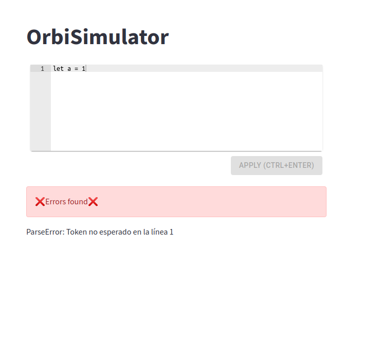

# Informe Proyecto Integrador (Inteligencia Artificial, Compilación y Simulación)

# El peligro en la órbita


## El proceso de compilación

### Gramáticas

Implementamos clases `Grammar`, `Production`, `Terminal`, `NonTerminal` para representar gramáticas de forma intuitiva y sencilla. `Grammar` se construye con una lista de terminales, una lista de no-terminales, un no-terminal inicial y una lista de producciones. La producción nosotros la consideramos como un no-terminal, con todas sus posibles partes derechas, por lo que le pasamos también una lista con las reglas sintáticas de cada posible parte derecha.

```python
# No terminales
E = Non_terminal('E', 'ast')
T = Non_terminal('T', 'ast', 'tmp')
F = Non_terminal('F', 'ast')
nts = [E, T, F]

# Terminales
mul = Terminal('*')
div = Terminal('/')
add = Terminal('+')
sub = Terminal('-')
openb = Terminal('(')
closedb = Terminal(')')
integer = Terminal('integer')
empty = Epsilon()
eof = Eof()
terminals = [add, sub, mul, div, openb, closedb, integer, empty, eof]

# Producciones
p1 = Production(E,
                [[T, add, E], [T, sub, E], [T]],
                [[(E1_rule, True)], [(E2_rule, True)], [(E3_rule, True)]]
                )

p2 = Production(T, 
                [[F, mul, T], [F, div, T], [F]], 
                [[(T1_rule, True)], [(T2_rule, True)], [(T3_rule, True)]]
                )

p3 = Production(F, 
                [[openb, E, closedb], [integer]],
                [[(F1_rule, True)], [(F2_rule, True)]]
                )
prods = [p1, p2, p3]

arth_grammar = Grammar(terminals, nts, E, prods)
```

### Lexer y Regex Engine

Implementamos nuestro propio Regex Engine como vimos en conferencia, haciendo uso de clases que implementamos como `Automaton` con los métodos para computar __epsilon clausura__ y __goto__, y también un método para convertir de autómata no determinista (__NFA__) a determinista (__DFA__). También implementamos una clase `State`, para representar los estados de un autómata (y el autómata en sí de otra forma), que nos facilitó el trabajo.

Diseñamos la siguiente gramática LL(1) de expresiones regulares básica para el Regex Engine:

```
   E -> T X
   X -> '|' T X
      | epsilon
   T -> F Y
   Y -> F Y 
      | epsilon
   F -> A P
   A -> character
      | ( E )
      | [ W ]
      | ε
      | \\n
   W -> R S
   S -> R S
      | epsilon
   R -> B Q
   Q -> - B Q
      | epsilon
   B -> character
   C -> character
   character -> any_character_except_metas
         | '\\' any_character_except_specials

   P -> M
      | epsilon
   M -> *
      | ?
      | +
```

Implementamos el algoritmo de parsing para gramáticas LL(1) visto en conferencia, para poder parsear los tokens de Regex, a un AST con algunas de las operaciones de Regex:

- Concatenación
- Union |
- Clausura *
- Clausura positiva +
- Rangos [0-9], [a-z]
- ?

Luego en la evaluación de ese AST es donde construimos el autómata que reconoce esa expresión regular.

Entonces para tokenizar, creamos una clase `Lexer`, que recibe como parámetro de entrada un diccionario que a cada expresión regular (un string) que represente un token en nuestro lenguaje, le corresponda un `Token_Type`. Dependiendo del orden que pasemos como argumento las expresiones regulares que queremos reconocer y tokenizar en nuestro lenguaje, es la prioridad que se le dará a dicho Token a la hora de reconocerlo, por tanto si está más arriba en la declaración, significa que tiene mayor prioridad.

``` python
lexer = Lexer([
    ('loop', Token_Type.loop),
    ('func', Token_Type.func),
    ("([A-Z])([a-z]|[A-Z]|[0-9])*", Token_Type.type_id_orbsim)
])
```

### Parser

Para parsear implementamos clases `Lr0Item` y `Lr1Item`, y el algoritmo de parsing para gramáticas LR(1) visto en conferencia utilizando la clase `State` que mencionamos previamente para representar cada estado del autómata LR(1), con sus correspondientes items LR(1). Para esto también añadimos un proceso de serialización para no tener que computar la tabla __ACTION-GOTO__ más de una vez, ya que es un proceso que puede demorar bastante.

### El DSL (OrbSim)
## Lenguaje Orbsim 
Nuestra idea fue tener un lenguaje con algunas cosas de un lenguaje de propósito general, como ciclos, condicionales, variables, y decidimos agregar clases, pues consideramos que es una herramienta que facilitaría la incorporación de nuevos tipos al lenguaje que permitieran crear abstracciones para nuevos objetos, muchos de estos podrían estar como builtin y 
ser útiles para crear objetos de la simulación.

Declaración de variables en Orbsim:
`let <Type> id '=' <Expr>`
```
let Int a = 1;
```

Condicionales en Orbsim:
`if (<CondExpr>) then {List[stmt]} else {List[stmt]};`

```
let Int a = 2;
let Int b = 20;
 
if (a > b) then {
    b = b-2+1;
} 
else{
    b = a +2-1;
};
....
```

Ciclos en Orbsim:

`loop (<CondExpr>) {List[stmt]};`
```
let Int counter = 0;
let Int doble   = 10;

loop(counter < 10){
    doble = 2*2;
    counter = counter + 1;
};
....
```


Declaración de funciones en Orbsim:
`func <type> id (List[Params]) {Body};  `


```
func Int fib(Int n){
    if (n == 1 || n == 0) then {
        ret 1;
    }
    else{
        ret fib(n-1) + fib(n-2);
    };
};

let Int f = fib(5);
```


Definiendo  una clase en Orbsim:
`class <ID> {};`
```
class Point {
    Int a;
    Int b;
    func Point add (Point b){
        ret make Point(this.a + b.a, this.b + b.b);
        };
    };
...
```

Creando una instancia de una clase en Orbsim:
```
   let Point a =  make Point(2,3);
   ...
```

Las clases tienen atributos cuyo valor se le asigna al crear
una instancia de la misma siempre verificando que los tipos de las expresiones a evaluar coincidan con los tipos de los atributos.


Nuestra idea fue tener un lenguaje con algunas cosas de un lenguaje de propósito general, como ciclos, condicionales, variables, y decidimos agregar clases, pues consideramos que es una herramienta que facilitaría la incorporación de nuevos tipos al lenguaje que permitieran crear abstracciones para nuevos objetos, muchos de estos podrían estar como built-in.


Usamos la siguiente gramática:

## Interfaz Gráfica:

Para la interfaz gráfica se usó streamlit. Se tiene un editor 

Si el código compila y ejecuta correctament:


En caso de haya algún error de compilación o ejecución.





Otros ejemplos:


También implementamos A*, pues consideramos que nos hará falta para el proyecto cuando esté más concebido, y ya empecemos a correr simulaciones.

