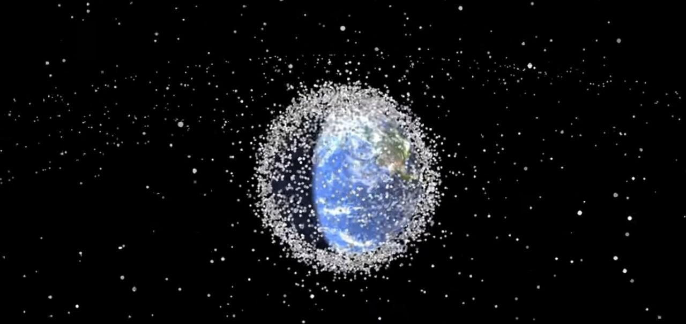

# Informe Proyecto Integrador (Inteligencia Artificial, Compilación y Simulación)

# El peligro en la órbita



## Para ejecutar el proyecto

```
streamlit run ./orbsim_main.py
```


## La simulación

Para la simulación hicimos una pequeña aplicación de python utilizando Pygame (como se muestra en la imagen anterior), donde se podrá visualizar todas las interacciones y eventos que se definan en el entorno de la simulación.

### El entorno

El entorno de nuestra simulación será un tablero 2D para representar el espacio que rodea a la Tierra y las entidades existentes en este espacio. Para representar este entorno utilizamos un `Quadtree progresivo`, o sea, que solamente se modifica en las regiones donde es necesario por la presencia de algún objeto, con el objetivo de encerrarlo y definir la región que este ocupa en el mapa. A pesar de no ser una estructura de datos recomendada para entornos dinámicos como el nuestro, hemos podido comprobar que para una demostración simple como la nuestra, con una profundidad de 8 el programa se comporta de forma aceptable con una cantidad moderada de entidades insertadas en el Quadtree.

Para poder realizar operaciones complejas en el Quadtree como el movimiento de objetos por el mapa, es necesario tener una representación en forma de grafo del mapa, y para esto es necesario computar para cada hoja del quadtree sus vecinos en el mapa. La representación de este grafo que utilizamos considera el centro de cada Quadtree como un nodo, y las aristas por lo tanto, van del centro de un Quadtree al centro de los Quadtrees vecinos. Acá mostramos 2 representaciones para los vecinos en un Quadtree que se mencionan en [1] por donde nos guiamos:


La que utilizamos es la que se encuentra a la izquierda.

### Las entidades

Las entidades que definimos por defecto para nuestra simulación son la basura espacial (`space debris`), los satélites y unos recolectores de basura espacial (agentes) que serán configurables desde el DSL (__Orbsim__) que diseñamos.

La tierra siempre está localizada en el centro de la pantalla, la basura espacial está localizada en `órbitas`, que no son más que elipses que definen la trayectoria de esta basura alrededor de la tierra, y que también serán configurables.

Los satélites tienen un tiempo de vida útil que se irá reduciendo con el paso del tiempo o debido a las colisiones que ocurran durante el transcurso de la simulación.

La basura espacial tendrá un tamaño definido(área) y una velocidad.

### Implicaciones y comportamiento del ambiente

Generalmente hay más de una órbita por lo que inevitablemente ocurrirán `colisiones` entre distintos objetos ya sean basura espacial, agentes o satélites de distintas órbitas, o incluso en la misma órbita dependiendo de la velocidad y el sentido con el que se mueva ese objeto en su órbita. Estas colisiones tendrán ciertas consecuencias y efectos, fragmentación de la basura (reducción de su tamaño), desaparición de cierta basura (absorción por otra basura mucho más grande), reducción de la vida útil de los satélites, etc. Para poder encontar las colisiones simplemente analizamos cada hoja del Quadtree y analizamos si cualquier par de objetos en esa hoja se solapa parcialmente.

### Eventos

En nuestra simulación también ocurrirán eventos configurables como la aparición de nueva basura espacial de forma ocasional, la puesta en órbita de nuevos satélites y la aparición de basura espacial como consecuencia de que un satélite haya agotado su vida útil.

### Los recolectores

Los `recolectores de basura espacial`, son agentes que definimos y que van a operar en nuestro entorno con el objetivo de recolectar la mayor cantidad de basura posible. Estos agentes tienen definidas varias características que impondrán restricciones a su comportamient:

- Tienen definida una capacidad límite que se reducirá cada vez que recojan algo de basura espacial, dependiendo del tamaño de la basura y que eventualmente les impedirá recolectar basura de gran tamaño.
  
- Tienen definida una cantidad de combustible que se irá reduciendo con cada acción que realicen en el entorno, ya sea recolectar basura o moverse, y que eventualmente los dejará sin combustible para realizar estas acciones por lo que quedarán inmóviles.

- Tienen definido un tiempo de vida que se irá reduciendo con el paso del tiempo y que eventualmente los dejará inservibles.

- Tienen definido un rango de percepción, que le permitirá ver mayor o menor parte del entorno para tomar sus decisiones. Este rango de percepción lo definimos en términos del Quadtree.

El comportamiento de los recolectores está definido por varias acciones y restricciones.

Acciones:

- Recolectar basura (el agente necesita estar bien cerca del objeto para realizar esta acción).
- Moverse hacia la basura si en su rango de percepción detectó basura.
- Moverse de forma aleatoria por el mapa sino detectó basura en su rango de percepción.
- No realizar nada (idle), para indicar que ya puede realizar una nueva acción la próxima vez.
  
Restricciones:

- Solo puede realizar acciones si le queda tiempo de vida.
- Siempre priorizará recolectar la basura de menor tamaño en su rango de percepción, aunque tenga que moverse para esto.
- Si hay 2 basuras con el mismo tamaño, priorizará recolectar la que esté más cercana.
- Solo puede moverse si le queda combustible.
- Solo puede recolectar basura si le queda suficiente combustible o le queda suficiente capacidad para recolectar la basura.

El movimiento lo realiza entre nodos del `Quadtree`, siguiendo el camino más corto utilizando `A*` y la distancia euclideana al destino como heurística.


Usamos el modelo de dos servidores en serie para la simulación del proceso de fabricación y 
despegue de cohete para la posterior puesta en órbita de los satélites que contiene el mismo.
El lambda usado y el tiempo de duración es configurable desde el lenguaje usando `custom_launchpad`.

Ejemplos:

```
custom_launchpad(5000, 0.001);
```

donde el primer parámetro es el tiempo de cierre y el segundo el lambda que se va a usar en la generación del tiempo de espera cada que vez que sea necesario para el próximo tiempo de arribo o para el tiempo de la próxima partida.


## El proceso de compilación

### Gramáticas

Implementamos clases `Grammar`, `Production`, `Terminal`, `NonTerminal` para representar gramáticas de forma intuitiva y sencilla. `Grammar` se construye con una lista de terminales, una lista de no-terminales, un no-terminal inicial y una lista de producciones. La producción nosotros la consideramos como un no-terminal, con todas sus posibles partes derechas, por lo que le pasamos también una lista con las reglas sintáticas de cada posible parte derecha.

```python
# No terminales
E = Non_terminal('E', 'ast')
T = Non_terminal('T', 'ast', 'tmp')
F = Non_terminal('F', 'ast')
nts = [E, T, F]

# Terminales
mul = Terminal('*')
div = Terminal('/')
add = Terminal('+')
sub = Terminal('-')
openb = Terminal('(')
closedb = Terminal(')')
integer = Terminal('integer')
empty = Epsilon()
eof = Eof()
terminals = [add, sub, mul, div, openb, closedb, integer, empty, eof]

# Producciones
p1 = Production(E,
                [[T, add, E], [T, sub, E], [T]],
                [[(E1_rule, True)], [(E2_rule, True)], [(E3_rule, True)]]
                )

p2 = Production(T, 
                [[F, mul, T], [F, div, T], [F]], 
                [[(T1_rule, True)], [(T2_rule, True)], [(T3_rule, True)]]
                )

p3 = Production(F, 
                [[openb, E, closedb], [integer]],
                [[(F1_rule, True)], [(F2_rule, True)]]
                )
prods = [p1, p2, p3]

arth_grammar = Grammar(terminals, nts, E, prods)
```

### Lexer y Regex Engine

Implementamos nuestro propio Regex Engine como vimos en conferencia, haciendo uso de clases que implementamos como `Automaton` con los métodos para computar __epsilon clausura__ y __goto__, y también un método para convertir de autómata no determinista (__NFA__) a determinista (__DFA__). También implementamos una clase `State`, para representar los estados de un autómata (y el autómata en sí de otra forma), que nos facilitó el trabajo.

Diseñamos la siguiente gramática LL(1) de expresiones regulares básica para el Regex Engine:

```
   E -> T X
   X -> '|' T X
      | epsilon
   T -> F Y
   Y -> F Y 
      | epsilon
   F -> A P
   A -> character
      | ( E )
      | [ W ]
      | ε
      | \\n
   W -> R S
   S -> R S
      | epsilon
   R -> B Q
   Q -> - B Q
      | epsilon
   B -> character
   C -> character
   character -> any_character_except_metas
         | '\\' any_character_except_specials

   P -> M
      | epsilon
   M -> *
      | ?
      | +
```

Implementamos el algoritmo de parsing para gramáticas LL(1) visto en conferencia, para poder parsear los tokens de Regex, a un AST con algunas de las operaciones de Regex:

- Concatenación
- Union |
- Clausura *
- Clausura positiva +
- Rangos [0-9], [a-z], [A-Z]
- ?

Luego en la evaluación de ese AST es donde construimos el autómata que reconoce esa expresión regular.

Entonces para tokenizar, creamos una clase `Lexer`, que recibe como parámetro de entrada un diccionario que a cada expresión regular (un string) que represente un token en nuestro lenguaje, le corresponda un `Token_Type`. Dependiendo del orden que pasemos como argumento las expresiones regulares que queremos reconocer y tokenizar en nuestro lenguaje, es la prioridad que se le dará a dicho Token a la hora de reconocerlo, por tanto si está más arriba en la declaración, significa que tiene mayor prioridad.

``` python
lexer = Lexer([
    ('loop', Token_Type.loop),
    ('func', Token_Type.func),
    ("([A-Z])([a-z]|[A-Z]|[0-9])*", Token_Type.type_id_orbsim)
])
```

### Parser

Para parsear implementamos clases `Lr0Item` con la representación de hasta dónde hemos leído los símbolos de una producción y `Lr1Item` el lookahead además, y el algoritmo de parsing para gramáticas LR(1) visto en conferencia utilizando la clase `State` que mencionamos previamente para representar cada estado del autómata LR(1), con sus correspondientes items LR(1). Para esto también añadimos un proceso de serialización para no tener que computar la tabla __ACTION-GOTO__ más de una vez, ya que es un proceso que puede demorar bastante. Nuestras clases `Lr0Item` y `Lr1Item` son hasheables, esto nos hizo falta porque durante el proceso de construcción del autómata LR(1) necesitábamos saber cuando generábamos un estado que ya existía, y que íbamos guardando en un diccionario de hash: estado.

### AST
En `orbsim_languaje.orbsim_ast` están los nodos para la representación del AST.
### Chequeo Semántico
Para el chequeo semántico se realizan tres recorridos sobre el AST usando el patrón visitor:
*TypeCollector*:Parar recolectar los tipos definidos en el lenguaje Orbsim. Estos tipos
pueden ser builtin o declarados mediante clases en el código.
*TypeBuilder*: Parar identificar los atributos y métodos definidos para los tipos.
*TypeChecker*: Para identificar el cumplimiento de las reglas semántica definidas para Orbsim

### El DSL (OrbSim)

Nuestra idea fue tener un lenguaje con algunas cosas de un lenguaje de propósito general, como ciclos, condicionales, variables, y decidimos agregar clases, pues consideramos que es una herramienta que facilitaría la incorporación de nuevos tipos al lenguaje que permitieran crear abstracciones para nuevos objetos, muchos de estos podrían estar como built-in.

Algunas reglas sintácticas que definimos en nuestro lenguaje:

- Los nombres de funciones y variables empiezan con minúscula.
- Los nombres de tipos built-in, así como de clases empiezan con mayúscula.
- La declaración de una clase, un ciclo, una condicional o una función se realiza entre llaves.
- Todas las instrucciones terminan con ;

Algunas reglas semánticas que definimos en nuestro lenguaje:
- No pueden exister dos variables con el mismo nombre en el mismo Scope.
- No pueden haber dos funciones  con el mismo nombre y la misma cantidad de parámetros.
- Dos métodos con el mismo nombre y la misma cantidad de parámetros no pueden estar definidos en un mismo tipo.
- La operación % solo es entre números enteros
- Las operaciones aritméticas +,-,*,/ puede ser entre dos números enteros o entre dos números float.
- Los elementos de una lista tienen que ser del mismo tipo
- 

# Tipos Builtins:
`Int`, `Float`, `String`, `List`(una lista de elementos del mismo tipo), `Bool`, `Vector3`
Declaración de variables en Orbsim:
`let <Type> id '=' <Expr>`
```
let Int a = 1;
```

Condicionales en Orbsim:
`if (<CondExpr>) then {List[stmt]} else {List[stmt]};`

```
let Int a = 2;
let Int b = 20;
 
if (a > b) then {
    b = b-2+1;
} 
else{
    b = a +2-1;
};
....
```

Ciclos en Orbsim:

`loop (<CondExpr>) {List[stmt]};`
```
let Int counter = 0;
let Int doble   = 10;

loop(counter < 10){
    doble = 2*2;
    counter = counter + 1;
};
....
```


Declaración de funciones en Orbsim:
`func <type> id (List[Params]) {Body};  `


```
func Int fib(Int n){
    if (n == 1 || n == 0) then {
        ret 1;
    }
    else{
        ret fib(n-1) + fib(n-2);
    };
};

let Int f = fib(5);
```

Definiendo  una clase en Orbsim:
`class <ID> {};`
```
class Point {
    Int a;
    Int b;
    func Point add (Point b){
        ret make Point(this.a + b.a, this.b + b.b);
        };
    };
...
```

Creando una instancia de una clase en Orbsim:
```
   let Point a =  make Point(2,3);
   ...
```

Las clases tienen atributos cuyo valor se le asigna al crear una instancia de la misma siempre verificando que los tipos de las expresiones a evaluar coincidan con los tipos de los atributos.

## Interfaz Gráfica:

Para la interfaz gráfica se usó streamlit parar el editor de código junto con pygame para la parte de simulación e IA . 

Si el código compila y ejecuta correctamente:


En caso de haya algún error de compilación o ejecución.


Otros ejemplos:


## Referencias

- [1] PATHFINDING IN 3D SPACE - A*, THETA*, LAZY THETA* IN OCTREE STRUCTURE. March 8, 2016 Ruoqi He & Chia-Man Hung